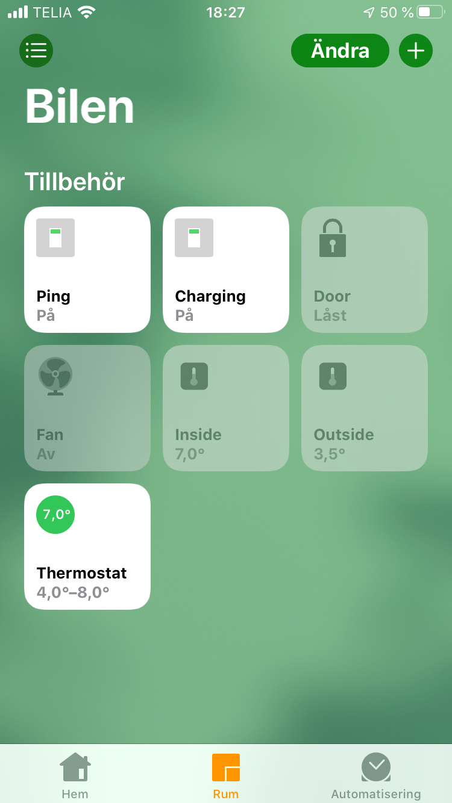

# homebridge-my-tesla

Homebridge plugin for Tesla owners. This plugin assumes you are familiar with Homebridge. 

Before installing this plugin please concider the plugin https://www.npmjs.com/package/homebridge-tesla
which was created by Nick Farina who also created Homebridge. Without his work this plugin would not be possible.

A Swedish screen shot below but may be explanatory.

<br/>

<br/>

## Installation

First, install Homebridge. See https://www.npmjs.com/package/homebridge
for more information.

Then install this plugin.

    $ sudo npm install homebridge-my-tesla -g --unsafe-perm


## Configuration File

Configure your **~/.homebridge/config.json** with the following platform.

```json

{
    "bridge": {
        "name": "Tesla",
        "username": "11:11:11:11:11:16",
        "port": 51821,
        "pin": "111-11-116"
    },

    "description": "Sample configuration file",

    "platforms": [{
        "platform": "Tesla",
        "name": "Tesla",
        "debug": false,
        "vehicles": [
        {         
            "name": "Model 3",       
            "vin": "5YJ3E7EB9KF240655",

            "username": "Your username at tesla.com",
            "password": "Your password at tesla.com",
        }
    ]
    }]
}

```

Of course, you have to supply your own name and **VIN** number and login credentials.


## What This Plugin Does

This plugin adds a number of controls to Apple HomeKit. Currently
it only adds controls to open the doors, control the HVAC and to display current temperature.

### Added accessories

#### Ping
When this switch is active your Tesla will never go into deep sleep. Every 5 minutes or so, a request is made to update the state of your car.  

```json
"ping": {
    "name": "Ping",
    "requiredBatteryLevel": 40,
    "timerInterval": 5,
    "enabled": true
}
 ```
* **name** - Localized name, specify the name you want in the Apple Home app.
* **requiredBatteryLevel** - Specifes the required battery level to operate. If battery level is below this level, the ping function will stop.
* **timerInterval** - Specifies the number of minutes between pings.
* **enabled** - Set this to **false** if you do not wish to expose this switch to Apple Home. 

#### Charging

The charging switch reflects the charging state.

```json
"charging": {
    "name": "Charging",
    "enabled": true
}
 ```
* **name** - Localized name, specify the name you want in the Apple Home app.
* **enabled** - Set this to **false** if you do not wish to expose this accessory to Apple Home. 


#### Door

Lock or unlock the doors using this switch. Unlocking the door also also enables keyless start.

```json
"doors": {
    "name": "Door",
    "enabled": true
}
 ```
* **name** - Localized name, specify the name you want in the Apple Home app.
* **enabled** - Set this to **false** if you do not wish to expose this accessory to Apple Home. 


#### Fan

Turn the HVAC **ON** or **OFF** using this switch.

```json
"hvac": {
    "name": "Fläkten",
    "requiredBatteryLevel": 20,
    "enabled": true
}
 ```
* **name** - Localized name, specify the name you want in the Apple Home app.
* **requiredBatteryLevel** - Specifes the required battery level to operate. If battery level is below this level, the fan function will stop.
* **enabled** - Set this to **false** if you do not wish to expose this accessory to Apple Home. 


#### Inside
Displays the inside temperature.

```json
"insideTemperature": {
    "name": "Inside",
    "enabled": true
}
 ```
* **name** - Localized name, specify the name you want in the Apple Home app.
* **enabled** - Set this to **false** if you do not wish to expose this accessory to Apple Home. 


#### Outside
Displays the outside temperature.

```json
"outsideTemperature": {
    "name": "Outside",
    "enabled": true
}
 ```
* **name** - Localized name, specify the name you want in the Apple Home app.
* **enabled** - Set this to **false** if you do not wish to expose this accessory to Apple Home. 


#### Thermostat
This enables you to control the inside temperature of your Tesla. Set it to 4 - 10 Celsius in the winter time to have a frost free vehicle in the morning.
Use automation to turn it on at a specific time.

```json
"thermostat": {
    "name": "Termostat",
    "requiredBatteryLevel": 40,
    "timerInterval": 2,
    "enabled": true
}
 ```

* **name** - Localized name, specify the name you want in the Apple Home app.
* **requiredBatteryLevel** - Specifes the required battery level to operate. If battery level is below this level, the thermostat function will stop.
* **timerInterval** - Specifies the number of minutes between checking the temperature.
* **enabled** - Set this to **false** if you do not wish to expose this accessory to Apple Home. 

## Siri

If you name things correctly you might get Siri to work by saying "Lock car", "Unlock car", "Turn on fan" or "Turn off fan"...

## Localize

By default, all the features (or buttons) available are added to the Home app automatically. 
Each feature has its own name and you may control each feature seperately since each 
feature has its own configuration. Default values are displayed below, you may change them as you wish.

```json

    "platforms": [{
        "platform": "Tesla",
        "name": "Tesla",
        "debug": true,
        "vehicles": [
        {         
            "vin": "5YJ3E7EB9KF240654",
            "username": "Replace with your username at tesla.com",
            "password": "Replace with your password at tesla.com",

            "accessories": {
                "ping": {
                    "name": "Ping",
                    "requiredBatteryLevel": 40,
                    "timerInterval": 5,
                    "enabled": true
                },
                "charging": {
                    "name": "Laddning",
                    "enabled": true
                },
                "hvac": {
                    "name": "Fläkten",
                    "requiredBatteryLevel": 20,
                    "enabled": true
                },
                "doors": {
                    "name": "Dörren",
                    "enabled": true
                },
                "outsideTemperature": {
                    "name": "Ute",
                    "enabled": true
                },
                "insideTemperature": {
                    "name": "Inne",
                    "enabled": true
                },
                "thermostat": {
                    "name": "Termostat",
                    "requiredBatteryLevel": 40,
                    "timerInterval": 2,
                    "enabled": true
                }
            }
        }
    ]
```

## Usage

As for now, it is a good idea to create a new home in Apple's Home app. Name
the new home to the same name of your car. Then add the this accessory to the newly created home.


## Updates

- **2019-11-15** - Accessory information updated properly with serial number (VIN) and firmware version.
- **2019-11-30** - Updated documentation.

